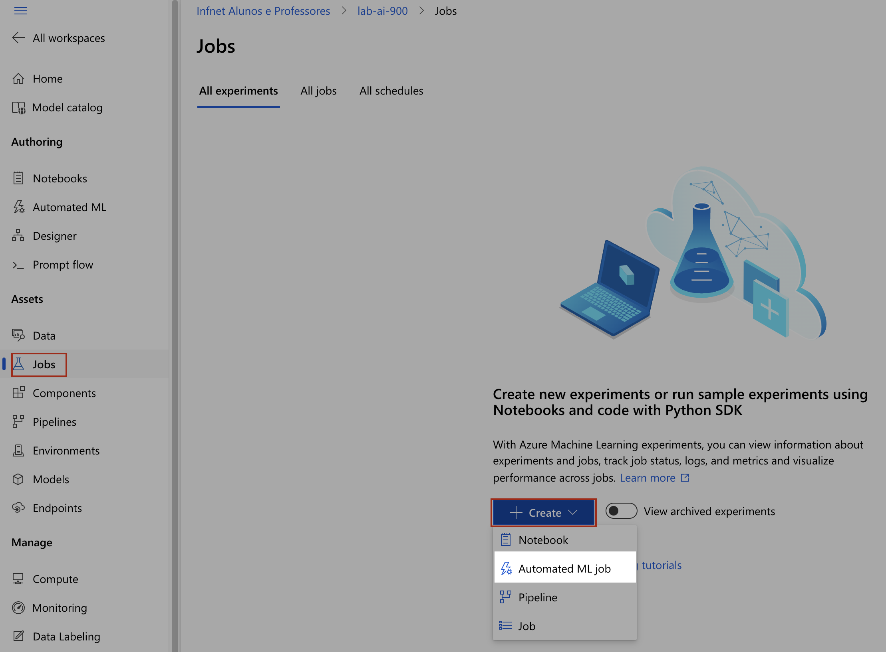

# Passo a passo para utilizar o Azure Machine Learning

## Passo 1: Criar o recurso do Azure Machine Learning

### 1.1 Acessar o portal do Azure
- [https://portal.azure.com/](https://portal.azure.com/)

### 1.2 Criar um novo recurso
- 

### 1.3 Pesquisar por "Azure Machine Learning" no Marketplace
- 

### 1.4 Criar o tipo de recurso "Azure Machine Learning"
- 

### 1.5 Preencher os campos obrigatórios
- No primeiro acesso não haverá um "Resource Group", basta criar um novo em "Create new" e inserir
o nome desejado.
- 
- Insira o nome do Workspace, deixe a região como "East US".
- Os campos "Storage account", "Key Vault" e "Application Insights" serão preenchidos
automaticamente após editar o nome do recurso, dessa maneira não é necessário preencher.
- "Container registry" é o repositório de imagens do Docker, deixe como "None".
- As outras abas não precisam de alterações, basta clicar em "Review + create" e "Create".
- Agora é só esperar a criação dos recursos.
- 
- Basta acessar o recurso criado clicando em "Go to resource" e depois em "Launch Studio".
- 
- 
- Também é possível acessar o Studio através de "All resources" e acessar o recurso criado.
- 
- 

## Passo 2: Criar um novo Trabalho de Machine Learning

### 2.1 Criar um novo "Job"
- Selecionar "Jobs" no menu lateral.
- 
- Clicar em "Create" e em "Automated ML job".
- 

#### 2.1.1 Select data asset
- Caso já exista um data asset, selecione-o e clique em "Next".
- 
- Para criar um novo data asset, clique em "Create" e seguir os passos de 2.1.1.1 a 2.1.1.7.
- 

##### 2.1.1.1 Data Type
- Preencha o campo "Name" com o nome desejado e clique em "Next".
- 

##### 2.1.1.2 Data Source
- Na tela seguinte, selecione "From local files" e clique em "Next".
- 

##### 2.1.1.3 Destination storage type
- Em "Datastore type" deixe como "Azure Blob Storage".
- E em seguida selecione o blob do workspace e clique em "Next".
- 

##### 2.1.1.4 File or folder selection
- Faça o download do arquivo .zip contendo um arquivo CSV e um arquivo MLTable do link
[https://aka.ms/bike-rentals](https://aka.ms/bike-rentals)
- Faça a extração da pasta.
- Selecione "Upload files or folder" e em seguida clique em "Upload files". Navegue até a pasta
extraída no passo anterior e selecione o arquivo CSV. Clique em "Next" e finalize a carga dos dados.
- 

##### 2.1.1.5 Settings
- Em "File format" deixe como "Delimited".
- Em "Delimiter" deixe como "Comma".
- Em "Encoding" deixe como "UTF-8".
- Em "Column headers" deixe como "Only first file has headers".
- Em "Skip rows" deixe como "None".
- 
- Clique em "Next".

##### 2.1.1.6 Schema
- Não é necessário alterar nada.
- Clique em "Next".

##### 2.1.1.7 Review
- Clique em "Create".

#### 2.1.2 Configure job
- Dê um nome para o experimento em "New experiment name".
- Selecione a coluna "rentals" como "Target column".
- Selecione o cluster em "Select Azure ML compute cluster"
- 
- Clique em "Next".
- Caso não exista um cluster, clique em "New" e siga os passos de 2.1.2.1 a 2.1.2.2.
- 

##### 2.1.2.1 Virtual Machine
- Selecione as opções como na imagem abaixo.
- 
- Clique em "Next".

##### 2.1.2.2 Advanced Settings
- Dê um nome para o cluster em "Compute name" e clique em "Create".
- 
- Clique em "Next".

#### 2.1.3 Select task and settings
- Basta selecionar "Regression" e em seguida "View additional configuration settings". Faça o mesmo
que descrito no passo 2.1.3.1 e em seguida clique em "Next".
- 

##### 2.1.3.1 Additional configuration settings
- Selecione as opções como na imagem abaixo.
- 
- Clique em "Save".

#### 2.1.4 Validate and test
- Altere "Validation type" para "Train-validation split", "Percentage validation of data" deixe em
"10" e "Test data asset (preview)" deixe em "No test data asset required".
- 
- Clique em "Finish".
- E é só aguardar o término do trabalho.
- 

## Passo 3: Criar Endpoints
### Problemas:
- Erro no processo de criar subscrição free tier.
- 
- Devido esse problema fui obrigado a criar uma subscrição de estudante.
- 
- Essa subscrição não permite criar endpoints.
- 
- Ao seguir todos os passos da documentação encontrada no [link](https://learn.microsoft.com/en-us/azure/machine-learning/how-to-deploy-online-endpoints?view=azureml-api-2&tabs=python) tive o mesmo erro ao tentar criar um endpoint.
- 
- Foi aberto um ticket de suporte para corrigir o erro da criação do free tier a fim de criar um endpoint de teste do modelo. Mediante a resolução do problema central este projeto será atualizado.
